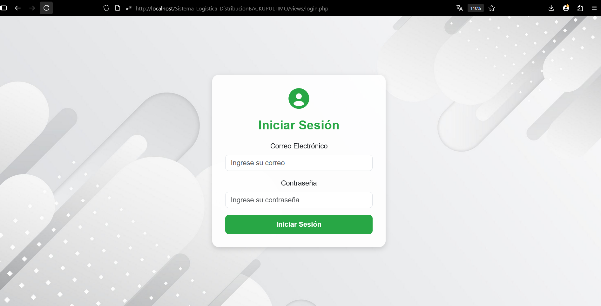
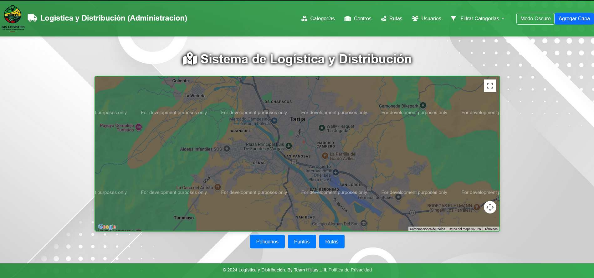
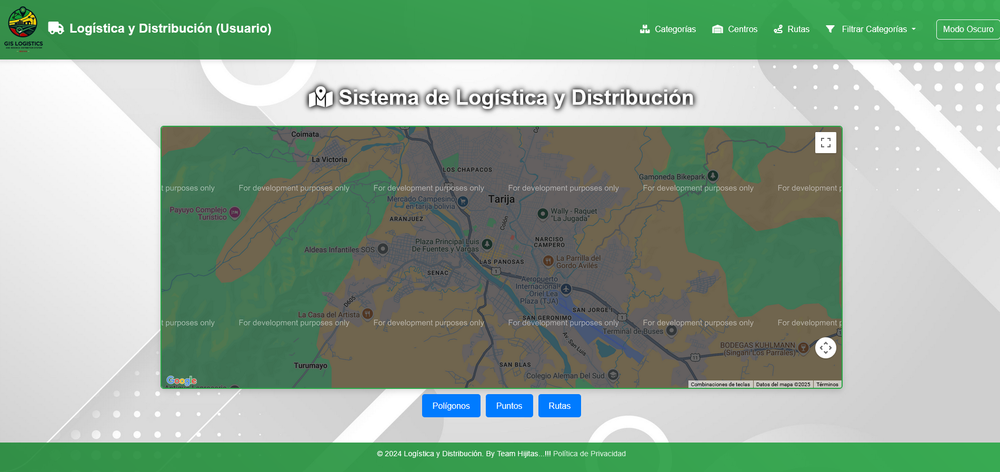
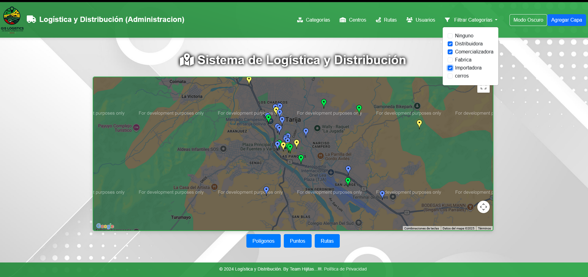
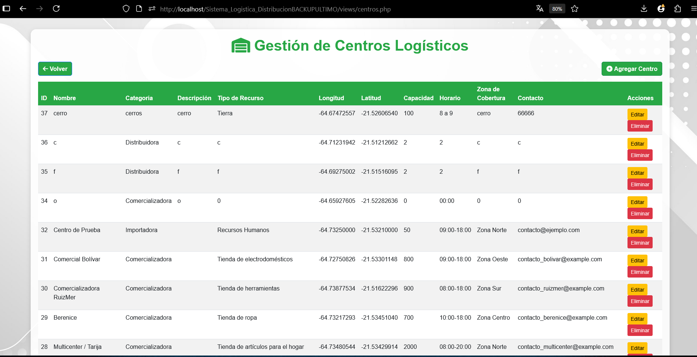
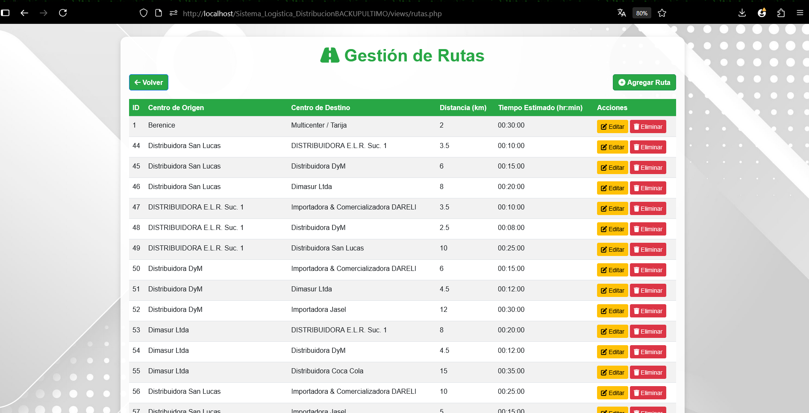

<p align="center">
  <a href="https://www.php.net/" target="_blank">
    
  </a>
</p>


# Sistema de Logística y Distribución

Sistema web desarrollado en PHP para gestionar centros logísticos, rutas de distribución y capas geoespaciales sobre un mapa interactivo utilizando la API de Google Maps y archivos creados en QGIS.

---

## Descripción

Este sistema permite visualizar y gestionar la red logística de una organización a través de:

- Registro y gestión de **centros logísticos**.
- Registro de **rutas** con distancia y tiempo estimado.
- Visualización geográfica mediante **capas generadas en QGIS** e importadas como archivos `.geojson`.
- Control de accesos mediante un sistema de **usuarios** y **roles** (Administrador, Operador, Visor).
- Interfaz simple para el usuario y compatible con navegadores modernos.

---


## Tecnologías usadas

- **PHP 8+** (sin frameworks, desarrollo puro)
- **PostgreSQL** como motor de base de datos
- **Google Maps JavaScript API** para visualización geoespacial
- **QGIS** para creación de capas `.geojson`
- **HTML + CSS + JavaScript** para la interfaz
- **XAMPP** para levantar el entorno local

---

## Instalación y ejecución

### 1. Requisitos

- XAMPP instalado (con Apache y PostgreSQL activo o configurado externamente)
- Navegador web moderno
- Editor de texto/código
- QGIS (si deseas crear nuevas capas geoespaciales)

### 2. Clona el repositorio

```bash
git clone https://github.com/velardep/Logistica_y_Distribucion.git
````

### 3. Configura la base de datos

```md
- Abre **pgAdmin** o conecta con `psql`.
- Crea una base de datos llamada:
```

```pgsql
logisticadistribucion
```

```md
- Restaura el archivo ubicado en:
```

```bash
sql/logisticadistribucionDB.sql
```

```md
Este archivo contiene las tablas, relaciones y datos actuales, incluidos los usuarios creados.
```

---

## Uso

```md
Coloca la carpeta del proyecto dentro de:
```

```bash
C:/xampp/htdocs/
```

```md
Abre XAMPP y ejecuta Apache.
Accede en el navegador a:
```

```bash
http://localhost/Logistica_y_Distribucion/public/index.php
```

```md
⚠️ Asegúrate de renombrar correctamente los archivos `.example` para que el sistema funcione.
```
## Capturas de pantalla

A continuación, algunas vistas del sistema en funcionamiento:

<p align="center">
  <br>
    <em>Pantalla de inicio de sesión</em>
</p>

<p align="center">
  <br>
    <em>Panel de administración</em>
</p>

<p align="center">
  <br>
    <em>Panel de usuarios</em>
</p>

<p align="center">
  <br>
    <em>Filtro por Categorias</em>
</p>

<p align="center">
  <br>
    <em>Gestion de Centros de Distribucion</em>
</p>

<p align="center">
  <br>
    <em>Gestion de Rutas</em>
</p>

---

## Capas geoespaciales (GeoJSON)

```md
Las capas se encuentran en la carpeta `capas/` y fueron generadas en QGIS. Para agregar nuevas capas (por ejemplo, estaciones, hospitales, etc.):

1. Abre **QGIS** y crea una nueva capa.
2. Exporta la capa como `.geojson`.
3. Colócala en la carpeta `capas/`.
4. Edita los archivos `.qmd` si corresponde.

El sistema reconocerá las capas nuevas dinámicamente.
```

---

## Usuarios predeterminados

```md
Los usuarios ya están insertados en el archivo `.sql` y podrás iniciar sesión con alguno para probar la plataforma.
```

---

## Notas importantes

```md
- NO se están usando migraciones (como en Laravel o Django), por lo tanto, la base de datos debe ser restaurada manualmente desde el archivo `.sql`.
- El sistema funciona exclusivamente con **PostgreSQL** (no compatible con MySQL por diferencias en sintaxis y funciones).
- El sistema **no está protegido contra inyecciones SQL** ni tiene validación robusta; se recomienda usarlo solo para fines educativos o pruebas.
- Recuerda **proteger tu clave de API de Google Maps** al momento de subir a producción.
```

```

